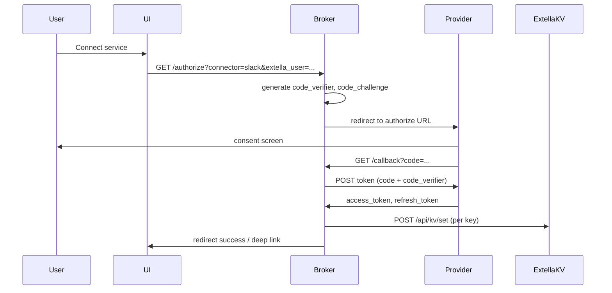

# OAuth-брокер (MVP) для мини-пресетов Extella

Extella не предоставляет встроенный `redirect_uri` для OAuth. Чтобы автоматизировать выдачу токенов, используйте **отдельный лёгкий брокер** (Cloudflare Worker, Vercel Serverless, Fly.io и т.п.), который выполняет Authorization Code Flow с **PKCE** и затем записывает токены в **KV Extella** через [`POST /api/kv/set`](https://api.extella.ai) (см. [extella-cli.md](extella-cli.md)).

## Цели MVP

1. Пользователь в UI нажимает «Подключить &lt;сервис&gt;».
2. Брокер редиректит на страницу согласия провайдера (scopes минимальны).
3. Провайдер возвращает `code` на `https://<broker>/callback`.
4. Брокер обменивает `code` на `access_token` / `refresh_token` (если выдаётся).
5. Брокер вызывает Extella `kv/set` для ключей, согласованных в `kv.schema.json` пресета.
6. Агент запускает `connector_*_healthcheck` для проверки.

## Поток (PKCE)

## Контракт брокера (рекомендуемый)

| Параметр | Описание |
|----------|----------|
| `connector_id` | Идентификатор мини-пресета (`slack`, `notion`, …) |
| `state` | Непредсказуемая строка + привязка к сессии пользователя |
| `code_verifier` | Случайный секрет PKCE; хранить только server-side до обмена |
| Extella | Запросы с `X-Auth-Token: <EXTELLA_TOKEN>` пользователя **или** с серверным токеном, если у вас связка user→Extella на бэкенде |

**Важно:** передача `EXTELLA_TOKEN` в браузер пользователя — риск. Предпочтительно: брокер аутентифицирует пользователя у вас (session), а KV пишет **ваш бэкенд** с доверенной учёткой.

## Регистрация приложения у провайдера

Для каждого OAuth-провайдера в консоли разработчика укажите:

- **Redirect URI:** `https://<your-broker-domain>/oauth/callback/<connector_id>` (или единый callback с разбором `state`).

Сохраните `client_id` / `client_secret` брокера в **секретах хостинга** (не в репозитории).

## Fallback без брокера

1. **Ручная вставка:** пользователь получает токен или ключ в консоли провайдера и выполняет `kv/set` (см. onboarding пресетов).
2. **Свой OAuth client:** пользователь создаёт OAuth App у провайдера, кладёт в KV `client_id`, `client_secret`, проходит consent локально; обмен `code` может выполнять **nohup-эксперт** с `{{placeholder}}` (см. [examples/nohup-expert-example.md](examples/nohup-expert-example.md)) — осторожно с хранением `client_secret`.
3. **Desktop + localhost:** для разработки callback на `http://127.0.0.1:<port>/callback`; не использовать в продакшене без понимания рисков.

## Минимальный набор для первой итерации

Реализовать в брокере **два провайдера** как эталон (например GitHub OAuth App и Google), затем добавлять конфиги по таблице [provider-matrix.md](provider-matrix.md).

## Refresh token

Если провайдер выдаёт `refresh_token`, храните его в KV с отдельным ключом (см. `kv.schema.json` пресета). Обновление access token:

- либо в **nohup**-задаче по расписанию,
- либо лениво в начале каждого эксперта перед вызовом API.

Не логировать refresh token и access token целиком.
